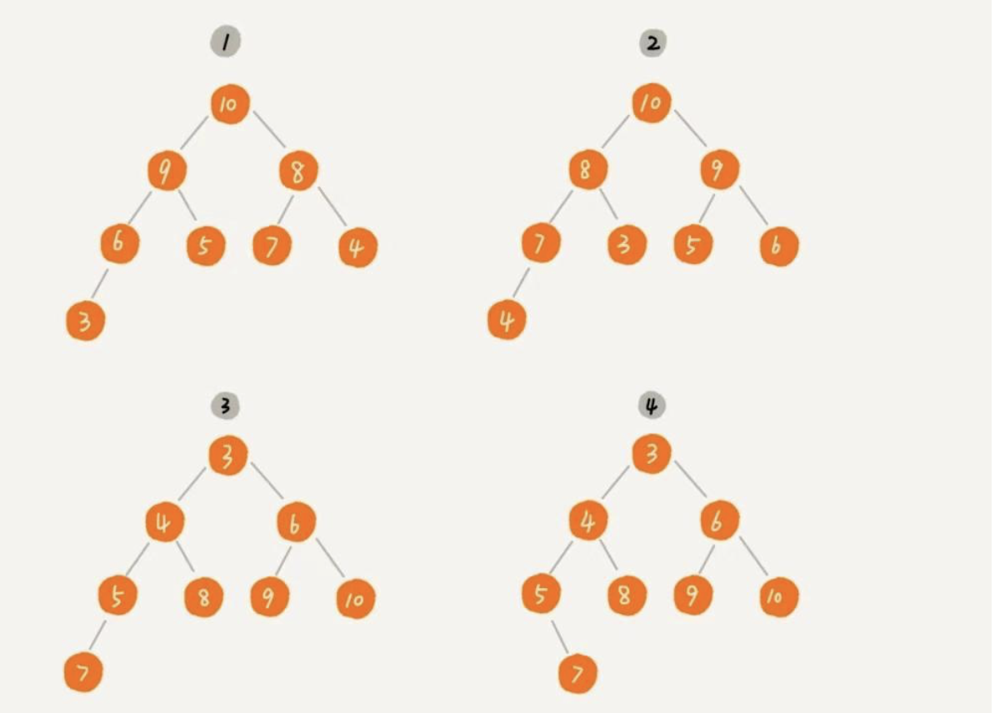
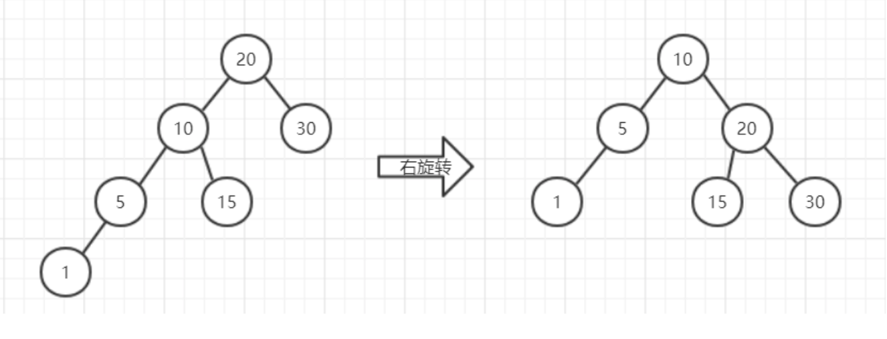
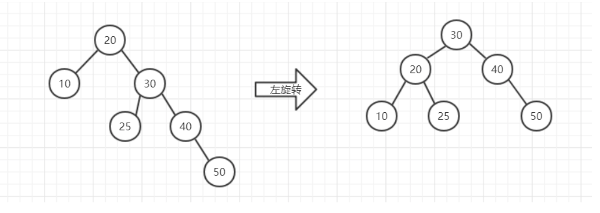
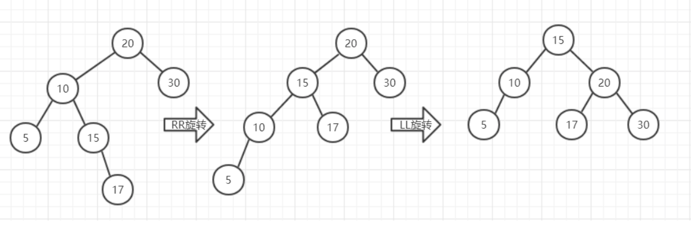
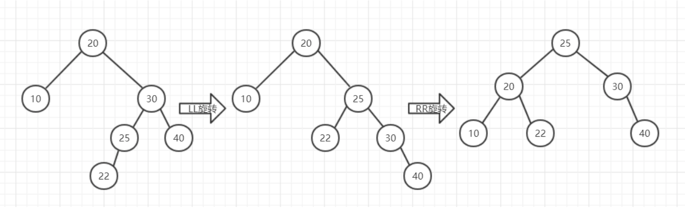

`1 堆示例`


上图中，1 和 2 是大顶堆，3 是小顶堆，4 不是堆。

`2 二叉树插入顺序`

若按照[5,1,3,9,13,8]这样的顺序插入，其流程是这样的：


若按照[1,3,5,8,9,13]这样的顺序插入，其流程是这样的：


如果在上面的二叉搜索树中查找13，是要将所有节点都遍历一遍的，时间复杂度就变成了O(n)，几乎就是一个链表。

`3 平衡二叉树调整`

（1）LL

这个变换就像是以10为中心，向右旋转，使10变成根节点，10的左子树不变，右子树变成了20，多余出的15正好挂在由于变换失去了左子树的20的左边。变换后结点从左到右的顺序依然没有变，所以15是正好挂在20的左边的。

（2）RR

RR与LL形式差不多，只不顾是反着来的。相当于进行一次左旋转。

RR与LL都只进行一次旋转即可，而LR与RL需要进行两次旋转

（3）LR

第一次相当于对5、10、15、17这棵子树进行了一次RR旋转，旋转方式与之前的RR方式相同，就像是以15为中心向左旋转，旋转的结果使得整棵树变成了LL的不平衡形态，然后再按照LL的旋转方式对整棵树处理。

（4）RL

RL同样是LR的相反模式，先将22、25、30、40这棵子树进行LL旋转，再将整棵树进行RR旋转

`3 各种树结构的时间复杂度`
```
操作  二叉查找树   平衡二叉树     红黑树
查找   O(n)        O(logn)     Olog(n)
插入   O(n)        O(logn)     Olog(n)
删除   O(n)        O(logn)     Olog(n)
```
note:

(1)二叉树或者二叉查找树，唯一不同在于数据的排序，其最坏的操作情况为所有的数据全部在一端时，时间复杂度O(n)，最好的情况为满足平衡二叉树情况，时间复杂度为O(logn)

[heap.png]: png/heap.png